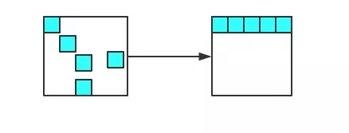

# GC
> 转载至神三元 https://juejin.im/post/5dcb7f706fb9a04aad01615a

V8 把堆内存分成了两部分进行处理 - 新生代内存和老生代内存


## GC 名称
| V8堆内存 | 新生代 | 老生代 |
| --- | --- | --- |
| 大小 | 64位-32M(16+16)<br>32位-16M(8+8) | 64位-1.4G<br>32位-0.7G |
| 算法 | 引用计数 + Scavenger | 标记-清除 + 标记-整理<br>(Mark-sweep + Mark-compact) |
| 作用 | 临时分配内存，处理存活时间短的引用 | 处理存活时间长引用，常驻内存引用 |
| 关键词 | 晋升、扫描指针、分配指针 | 增量标记、整理内存碎片 |


### v8 为啥设置内存上限

V8 为什么要给它设置内存上限？明明我的机器大几十G的内存，只能让我用这么一点？
究其根本，是由两个因素所共同决定的，一个是JS单线程的执行机制，另一个是JS垃圾回收机制的限制。

首先JS是单线程运行的，这意味着一旦进入到垃圾回收，那么其它的各种运行逻辑都要暂停; 另一方面垃圾回收其实是非常耗时间的操作，V8 官方是这样形容的:

以 1.5GB 的垃圾回收堆内存为例，V8 做一次小的垃圾回收需要50ms 以上，做一次非增量式(ps:后面会解释)的垃圾回收甚至要 1s 以上。

可见其耗时之久，而且在这么长的时间内，我们的JS代码执行会一直没有响应，造成应用卡顿，导致应用性能和响应能力直线下降。因此，V8 做了一个简单粗暴的
选择，那就是限制堆内存，也算是一种权衡的手段，因为大部分情况是不会遇到操作几个G内存这样的场景的。
不过，如果你想调整这个内存的限制也不是不行。配置命令如下:

```js
// 这是调整老生代这部分的内存，单位是MB。后面会详细介绍新生代和老生代内存
node --max-old-space-size=2048 xxx.js 

// 这是调整新生代这部分的内存，单位是 KB。
node --max-new-space-size=2048 xxx.js
```


### 1.新生代


其中From部分表示正在使用的内存，To 是目前闲置的内存

1. 当进行垃圾回收时，V8 将From部分的对象通过**_引用计数_**算法检查一遍，如果是存活对象那么复制到To内存中(在To内存中按照顺序从头放置的)，如果是非存活对象直接回收即可。

    深色的小方块代表存活对象，白色部分表示待分配的内存，由于堆内存是连续分配的，这样零零散散的空间可能会导致稍微大一点的对象没有办法进行空间分配，
这种零散的空间也叫做内存碎片。刚刚介绍的新生代垃圾回收算法也叫Scavenge算法。

    Scavenge 算法主要就是解决内存碎片的问题，在进行一顿复制之后，To空间变成了这个样子:
    

2. 当所有的From中的存活对象按照顺序进入到To内存之后，From 和 To 两者的角色对调，From现在被闲置，To为正在使用，如此循环。

3. 那么新生代中的变量如果经过多次回收后依然存在，那么就会被放入到老生代内存中，这种现象就叫晋升

#### 1.1 什么时候进行新生代垃圾回收? 
当正在使用的内存写满的时候，开始垃圾回收。

#### 1.2 from怎么复制到to的？
to上有2个指针，一个是扫描指针，一个是分配指针，开始时候，扫描指针是和分配指针重合的，每当扫描指针放入一个引用，分配指针就向后以后一位，直到扫描指针和分配指针再次重合为止

#### 1.3 什么时候晋升到老生代
已经经历过一次 Scavenge 回收。
To（闲置）空间的内存占用超过25%

### 2.老生代

现在进入到老生代的垃圾回收机制当中，老生代中累积的变量空间一般都是很大的，当然不能用Scavenge算法啦，浪费一半空间不说，对庞大的内存空间进行复制岂不是 劳民伤财

**老生代主要采用Mark-Sweep和Mark-compact**：

1. 进行标记-清除。这个过程主要分成两个阶段，即标记阶段和清除阶段。首先会遍历堆中的所有对象，对它们做上标记，然后对于代码环境中使用的变量以及被**强引用**的变量取消标记，剩下的就是要删除的变量了，在随后的清除阶段对其进行空间的回收。（Mark-Sweep）

2. 整理内存碎片。V8 的解决方式非常简单粗暴，在清除阶段结束后，把存活的对象全部往一端靠拢。（Mark-compact）

    


#### 2.1增量标记

由于JS的单线程机制，V8 在进行垃圾回收的时候，不可避免地会阻塞业务逻辑的执行，倘若老生代的垃圾回收任务很重，那么耗时会非常可怕，严重影响应用的性能。

那这个时候为了避免这样问题，V8 采取了增量标记的方案，即将一口气完成的标记任务分为很多小的部分完成，每做完一个小的部分就"歇"一下，就js应用逻辑执行一会儿，

然后再执行下面的部分，如果循环，直到标记阶段完成才进入内存碎片的整理上面来。其实这个过程跟React Fiber的思路有点像，这里就不展开了。

经过增量标记之后，垃圾回收过程对JS应用的阻塞时间减少到原来了1 / 6, 可以看到，这是一个非常成功的改进。

#### 2.2 什么时候开始老生代垃圾回收
内存不够时，开始增量回收


#### 示例demo
```js
// 有引用，将被晋升到老生代清除
var a = {};
alert(a);

// 无引用，将在新生代阶段标记清除
var b = {};

function fn() {
    var x = 'test';
    return function () {
        // 闭包存在堆内存，常驻内存
        return x;
    }
}

fn();

// 强引用-不会被清除
var o = new Map();
// 弱引用-会被清除
var wo = new WeakMap();
```


## node 查看内存

```js
process.memoryUsage
```

```sh
node --trace-gc app.js
```