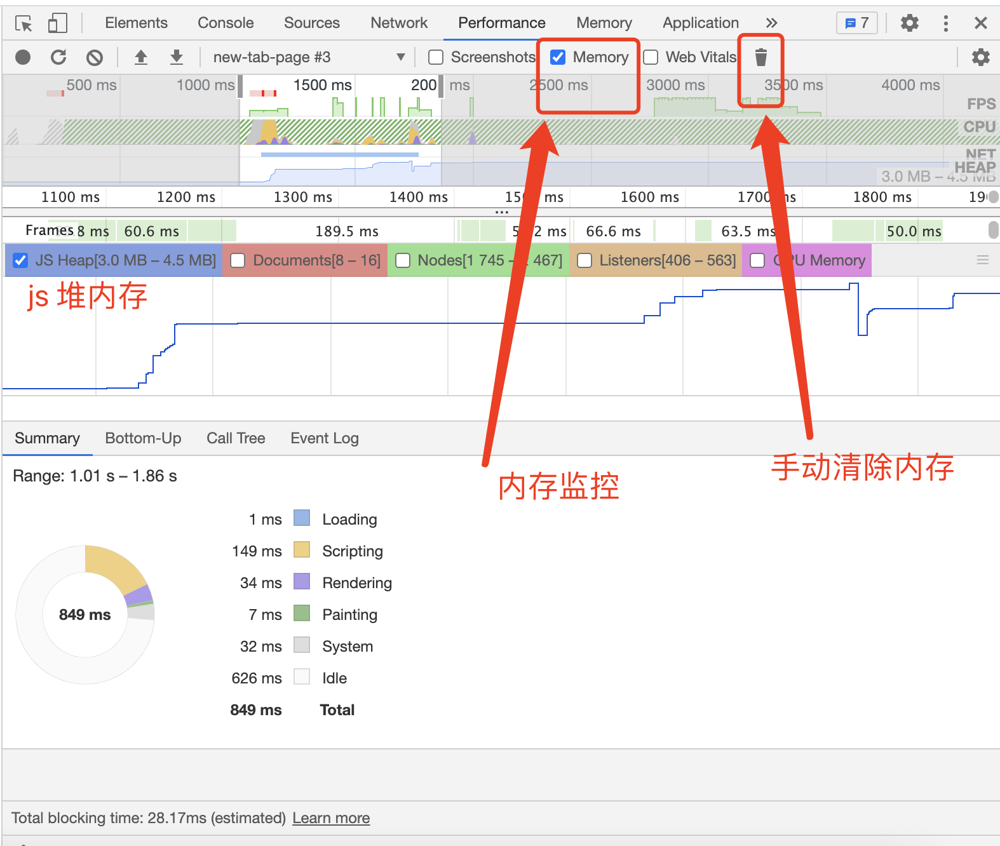
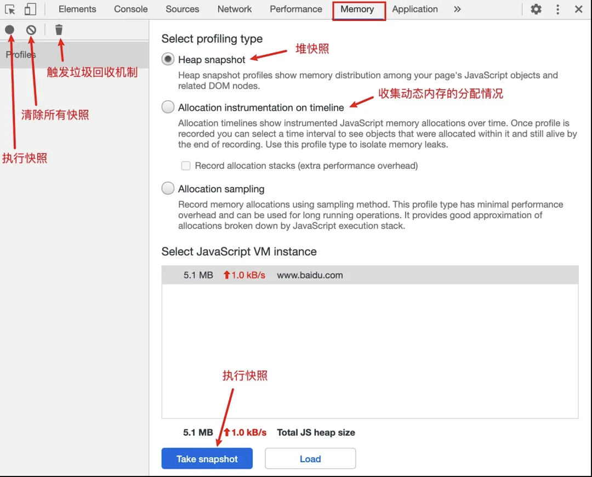

# 内存泄漏 Memory Leak

> <https://juejin.cn/post/6844904048961781774#heading-8>

## 一. 什么是内存泄漏

字面意思好像是内存流出来了
可以肯定非也

程序运行需要内存, 当使用的内存空间长时间不能释放, 且无法被 gc 回收, 内存占用越来越高, 久而久之内存不够用了, 轻则影响系统性能，重则导致进程崩溃

不再用到的内存，没有及时释放，就叫做内存泄漏（memory leak）
(引用:[阮一峰老师](http://www.ruanyifeng.com/blog/2017/04/memory-leak.html))

引用别人家的比喻:
比如有10张纸，本来一人一张，画完自己擦了还回去，别人可以继续画，现在有个坏蛋要了纸不擦不还，然后还跑了找不到人了，如此就只剩下9张纸给别人用了，这样的人多起来后，最后大家一张纸都没有了。

### 内存泄漏和内存溢出一回事吗

Memory Leak VS Memory Overflow

内存泄漏: 无法释放已申请的内存
内存溢出: 申请不到足够的内存, 给的 int 类型空间大小, 而用来存放 long 类型数据
两者关系: 内存泄露 → 剩余内存不足 → 后续申请不到足够内存 → 内存溢出

## 二. 内存泄漏会导致哪些问题

1. 页面的性能随时间延长越来越差, 有感知的卡顿假死
2. 进程崩溃

## 三. 如何识别内存泄漏

正常: 有升有降
泄漏: 如果连续五次垃圾回收之后，内存占用一次比一次大，就有内存泄漏。这就要求实时查看内存占用
(引用:[阮一峰老师](http://www.ruanyifeng.com/blog/2017/04/memory-leak.html))

### 浏览器中怎么看内存状态

* 浏览器 控制台 performance 选择 memory 录制

> <https://mp.weixin.qq.com/s/5PwqCbYvwtBHQBqyENJf1g>



* 浏览器 控制台 memeory 查看堆(heap)内存快照

> <https://blog.csdn.net/c11073138/article/details/84700482>



* 蓝色: 未回收, 灰色: 已回收
* Constructor：构造函数，节点下的对象都是由改构造函数创建而来。
  * (global property)：全局对象和普通对象的中间对象，和常规思路不同。比如在Window上定义了一个Person对象，那么他们之间的关系就是[global] => (global property) => Person。之所以使用中间对象，是出于性能的考虑。
  * (closure)：使用函数闭包的对象。
  * (array, string, number, regexp)：一系列对象类型，其属性指向Array/String/Number/Regexp。
  * HTMLDivElement/HTMLAnchorElement/DocumentFragment：元素的引用或者代码引用的指定文档对象
* Distance：与根节点的距离。
* Shallow size：对象的直接内存总数，直接内存是指对象自身占用的内存大小。
* Retained size：对象的最大保留内存，保留内存是指对象被删除后可以释放的那部分内存。

### node 中窥探内存使用状态

```sh
## --expose-gc参数表示允许手动执行垃圾回收机制
node --expose-gc  
## 手动执行一次垃圾回收，保证获取的内存使用状态准确
global.gc();
## 查看内存占用的初始状态
process.memoryUsage();

## ... coding your demo code
## 调用 process.memoryUsage(); 查看当前内存使用快照
## 调用 global.gc(); 手动清空内存
```

## 四. 都有哪些写法可以内存泄漏 (就是玩)

1. 闭包
2. 全局变量
3. 游离的 dom 节点, 没删除干净的 dom 节点 `(在筛选框里输入**detached**，于是就会展示所有脱离了却又未被清除的节点对象)`
4. console
5. 定时器

## 五. 我们需要注意什么减少内存泄漏

1. 慎用全局变量, 闭包
2. 闭包全局变量及时清除 null
3. 能用 WeakMap 不用 Map, 能用 WeakSet 不用 Set, 弱引用是不计入垃圾回收机制的
4. console 不要在生产使用
5. 避免数据频繁的突然瞬间增加减小, 以防止GC频繁工作, 阻断 js 进程
   1. ❌  arr = []  ✅  arr.length = 0
   2. 尽可能的避免创建新的对象, 创建新对象就需要 gc
   3. setTimeout 定时器回调函数避免每次执行都创建一个新的函数

## 六. 如果监控内存泄漏

### 浏览器

```js
console.log(performance.memory); // chrome, edge支持, 其他浏览器不支持
// {
// jsHeapSizeLimit: 4294705152  // 内存大小限制, 上下文内可用堆的最大体积，以字节计算
// totalJSHeapSize: 5766100     // 可使用的堆内存
// usedJSHeapSize: 5584928      // 已使用的内存大小
// }
```

usedJSHeapSize不能大于totalJSHeapSize，如果大于，有可能出现了内存泄漏

### node

```js
console.log(process.memoryUsage());
// { rss: 27709440,     // rss（resident set size）：所有内存占用，包括指令区和堆栈
//  heapTotal: 5685248, // heapTotal："堆"占用的内存，包括用到的和没用到的
//  heapUsed: 3449392,  // heapUsed：用到的堆的部分  3449392 / 1024 / 1024 Mb
//  external: 8772 }    // V8 引擎内部的 C++ 对象占用的内存
```

or

```sh
node --trace-gc app.js
```

## 七. 你需要知道的相关姿势

1. 执行上下文
2. 垃圾回收机制 (garbage collector)

### 数据类型 8种

* 值类型-栈
* 引用类型-堆

1. boolean
2. number（Number采用的是IEEE 754标准的64 位双精度浮点数）
3. bigint (表示大于 2^53 - 1 的整数)
4. string
5. undefined
6. null
7. symbol  (原始)
8. object （引用）

### 执行上下文

1. GEC 全局上下文（全局对象）
Global Execution Context
GC 在栈低，是不会弹出的

2. FnEC 函数执行上下文
Execution Context = {VO, this, scope}
EC 在GC上面，执行完通过垃圾回收器弹出

2.1 scope
包含了所有上层VO的分层链，它属于当前函数上下文，并在函数声明的时候被创建，保存在函数中
静态的（不变的），一直都存在，直到函数销毁

### 垃圾回收机制 (garbage collector)

有些语言是程序员亲力亲为管理内存 (C/C++)
有些语言提供自动内存管理(javascript), 这就是垃圾回收机制 (garbage collector)

即我们不需要关心何时为变量分配多大的内存，也不需要关心何时去释放内存，因为这一切都是自动的。但这不表示我们不需要关心内存的管理！！！！否则也不会有本文讨论的内存泄露了

#### 栈内存

##### 栈内存存放内容

1. 执行上下文
2. 值类型

##### 栈内存垃圾回收

1. 函数执行完毕, 其所在的执行上下文占用内存就会被释放 (但是内部变量还在占用内存)
2. JavaScript 的垃圾回收器会每隔一段时间遍历调用栈，当遍历调用栈时发现变量没有被引用，会被标记-清除

#### 堆内存

##### 新生代 (32M)

1. 引用计数 (reference counting)
    * 语言引擎有一张"引用表"，保存了内存里面所有的资源（通常是各种值）的引用次数
    * 引用次数若果为 0, 就会被清除释放内存
2. Scavenge (清除整理算法)

无引用的变量就在这里被清除
有引用的变量被放到老生代处理

##### 老生代 (1.4G)

1. 增量标记清除 (类似 fiber )
2. 碎片整理

闭包产生的变量常驻老生代内存
强引用(new Map)常驻老生代内存

#### 举例说明

##### 🌰  demo-01

```js
const arr = [1, 2, 3, 4];
console.log('hello world')
```

变量arr是仅有的对这个值的引用，因此引用次数为1。尽管后面的代码没有用到arr，它还是会持续占用内存

```js
let arr = [1, 2, 3, 4];
console.log('hello world')
arr = null;
```

##### 🌰  demo-02

```js
// 强引用-不会被清除
var o = new Map();

// 弱引用-不作为垃圾回收技术引用次数
const wm = new WeakMap();

const element = document.getElementById('example');

wm.set(element, 'some information');
wm.get(element) // "some information"
```

1. WeakMap 里面对element的引用就是弱引用，不会被计入垃圾回收机制
2. dom 对象的引用计数是1 (element)，而不是2
3. 这时一旦消除对 dom 对象的引用，它占用的内存就会被垃圾回收机制释放, 同时 Weakmap 保存的这个键值对，也会自动消失, 也就是说WeakMap 内部的引用，就会自动被垃圾回收清除

###### 验证 WeckMap 在内存泄漏中的作用

* 1. 测试 Map

```sh
## --expose-gc参数表示允许手动执行垃圾回收机制
node --expose-gc  
## 手动执行一次垃圾回收，保证获取的内存使用状态准确
global.gc();
## 查看内存占用的初始状态
process.memoryUsage();
let mp = new Map();
let b = new Object({});
global.gc();
process.memoryUsage();
mp.set(b, new Array(5 * 1024 * 1024));
global.gc();
process.memoryUsage();
b = null;
global.gc();
process.memoryUsage();
```

* 2. 测试 WeakMap

```sh
## --expose-gc参数表示允许手动执行垃圾回收机制
node --expose-gc  
## 手动执行一次垃圾回收，保证获取的内存使用状态准确
global.gc();
## 查看内存占用的初始状态
process.memoryUsage();
let wm = new WeakMap();
let b = new Object({});
global.gc();
process.memoryUsage();
wm.set(b, new Array(5 * 1024 * 1024));
global.gc();
process.memoryUsage();
b = null;
global.gc();
process.memoryUsage();
```
