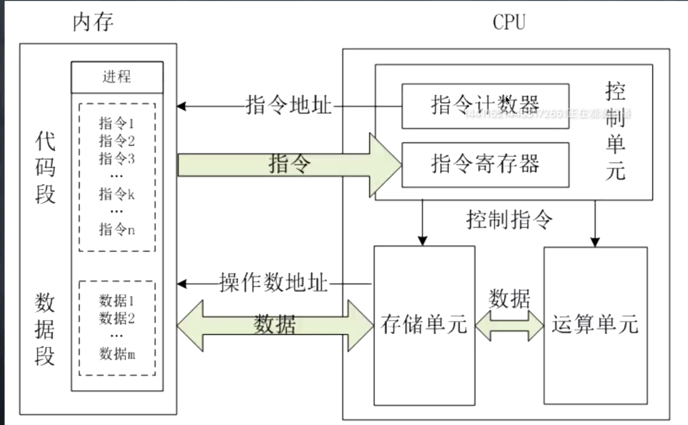

## CPU & 内存

指令计数器
指令寄存器

## 语言

1. 机器指令 0101
2. 汇编语言 将0101指令转成单词 (难点:寻址方式)
3. 低级语言 C语言，面向对象的（难点:指针）
4. 高级语言 JAVA C++

### 汇编语言
1. 指令 + 数据，没有语句
2. 依赖硬件平台限制，可移植性很低
3. 直接操作硬件
4. 是最贴近底层的计算机语言

## 编译
Makefile

nginx - C
libuv - C
C 用在网络相关和嵌入式
C++用在复杂引擎和应用软件方面，游戏
C 手动管理内存
C++半自动，引入了自能指针，帮你释放内存，但是仍然需要手动管理内存
goo 是全自动的，GC机制，
rust 支持手动、自动

### 编译器
windows: visual c++
linux/unix: gcc/g++
mac: xcode/g++

### C
1. 指针
2. 内存管理
3. 算法