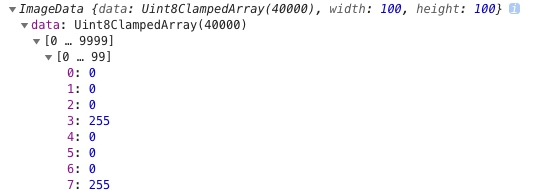
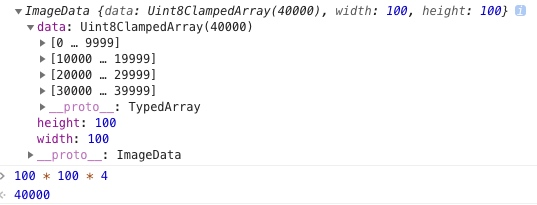
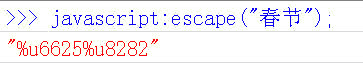
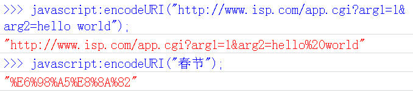
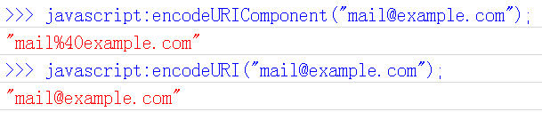

# 编码

## bit |  byte  | word

bit = 二进制中的1位     中国大陆作比特，台湾作位元    是信息的最小单位
byte = 8 *bit        中国大陆作字节，台湾作位元组
word = 2* byte 字

1kb = 1024 *byte = 2^10 byte
1mb = 1024* kb   = 2^20 byte
1gb = 1024 * mb   = 2^30 byte

也就是说与传输速度有关的b一般指的是bit。
与容量有关的b一般指的是byte。

颜色 rgba 用 00-ff 十六进制 标识一个颜色通道 转换为 十进制 `15 * 16^1 + 15 * 16^0 = 255` 转换为 二进制 `2^8` 即 8bit 即 1byte， 所以一个颜色占用 4byte 内存

计算 100 * 100 canvas 画布占用内存，根据上诉原理，通过  ctx.getImageData 可推算

```js
  var canvas = document.getElementById("canvas");
  var ctx = canvas.getContext("2d");
  ctx.rect(10, 10, 100, 100);
  ctx.fill();

  console.log(ctx.getImageData(50, 50, 100, 100));
```





可以看到 1个像素是 用 4 *8bit 表示，即 4byte
所以: 100* 100 * 4byte = 40000 byte

---

## 字节

> 很久很久以前，有一群人，他们决定用**8个可以开合的晶体管**来组合成不同的状态，以表示世界上的万物。他们看到8个开关状态是好的，于是他们把这称为"字节"。

再后来，他们又做了一些可以处理这些字节的机器，机器开动了，可以用字节来组合出很多状态，状态开始变来变去。他们看到这样是好的，于是它们就这机器称为"计算机"。

开始计算机只在美国用。八位的字节一共可以组合出256(2的8次方)种不同的状态。

## ASCII

他们把其中的编号从0开始的32种状态分别规定了特殊的用途，一但终端、打印机遇上约定好的这些字节被传过来时，就要做一些约定的动作。遇上00x10, 终端就换行，遇上0x07, 终端就向人们嘟嘟叫，例好遇上0x1b, 打印机就打印反白的字，或者终端就用彩色显示字母。他们看到这样很好，于是就把这些0x20以下的字节状态称为"控制码"。
　　
他们又把所有的空格、标点符号、数字、大小写字母分别用连续的字节状态表示，一直编到了第127号，这样计算机就可以用不同字节来存储英语的文字了。大家看到这样，都感觉很好，于是大家都把这个方案叫做 ANSI 的"Ascii"编码（American Standard Code for Information Interchange，美国信息互换标准代码）。当时世界上所有的计算机都用同样的ASCII方案来保存英文文字。

后来，就像建造巴比伦塔一样，世界各地的都开始使用计算机，但是很多国家用的不是英文，他们的字母里有许多是ASCII里没有的，为了可以在计算机保存他们的文字，他们决定采用127号之后的空位来表示这些新的字母、符号，还加入了很多画表格时需要用下到的横线、竖线、交叉等形状，一直把序号编到了最后一个状态255。从128到255这一页的字符集被称"扩展字符集"。

> 我们知道，在计算机内部，所有的信息最终都表示为一个二进制的字符串。每一个二进制位（bit）有0和1两种状态，因此八个二进制位就可以组合出256种状态，这被称为一个字节（byte）。也就是说，一个字节一共可以用来表示256种不同的状态，每一个状态对应一个符号，就是256个符号，从0000000到11111111

## GB2312

等中国人们得到计算机时，已经没有可以利用的字节状态来表示汉字，况且有6000多个常用汉字需要保存呢。但是这难不倒智慧的中国人民，我们不客气地把那些127号之后的奇异符号们直接取消掉, 规定：一个小于127的字符的意义与原来相同，但两个大于127的字符连在一起时，就表示一个汉字，前面的一个字节（他称之为高字节）从0xA1用到0xF7，后面一个字节（低字节）从0xA1到0xFE，这样我们就可以组合出大约7000多个简体汉字了。在这些编码里，我们还把数学符号、罗马希腊的字母、日文的假名们都编进去了，连在 ASCII 里本来就有的数字、标点、字母都统统重新编了两个字节长的编码，这就是常说的"全角"字符，而原来在127号以下的那些就叫"半角"字符了。

中国人民看到这样很不错，于是就把这种汉字方案叫做 "GB2312"。GB2312 是对 ASCII 的中文扩展。

## GBK

但是中国的汉字太多了，我们很快就就发现有许多人的人名没有办法在这里打出来，特别是某些很会麻烦别人的国家领导人。于是我们不得不继续把 GB2312 没有用到的码位找出来老实不客气地用上。

后来还是不够用，于是干脆不再要求低字节一定是127号之后的内码，只要第一个字节是大于127就固定表示这是一个汉字的开始，不管后面跟的是不是扩展字符集里的内容。结果扩展之后的编码方案被称为 GBK 标准，GBK 包括了 GB2312 的所有内容，同时又增加了近20000个新的汉字（包括繁体字）和符号。

后来少数民族也要用电脑了，于是我们再扩展，又加了几千个新的少数民族的字，GBK 扩成了 GB18030。从此之后，中华民族的文化就可以在计算机时代中传承了。

## GB2312、GBK和GB18030

依次超集, GB18030 最全

## DBCS

中国的程序员们看到这一系列汉字编码的标准是好的，于是通称他们叫做 "DBCS"（Double Byte Charecter Set 双字节字符集）。在DBCS系列标准里，最大的特点是两字节长的汉字字符和一字节长的英文字符并存于同一套编码方案里，因此他们写的程序为了支持中文处理，必须要注意字串里的每一个字节的值，如果这个值是大于127的，那么就认为一个双字节字符集里的字符出现了。那时候凡是受过加持，会编程的计算机僧侣们都要每天念下面这个咒语数百遍：

　　"一个汉字算两个英文字符！一个汉字算两个英文字符……"

## Unicode

正在这时，大天使加百列及时出现了——一个叫 ISO （国际标谁化组织）的国际组织决定着手解决这个问题。他们采用的方法很简单：废了所有的地区性编码方案，重新搞一个包括了地球上所有文化、所有字母和符号的编码！他们打算叫它"Universal Multiple-Octet Coded Character Set"，简称 **UCS**, 俗称 "UNICODE"。

1. UNICODE 开始制订时，计算机的存储器容量极大地发展了，空间再也不成为问题了。于是 ISO 就直接规定必须用两个字节，也就是16位来统一表示所有的字符，对于ascii里的那些“半角”字符，UNICODE 包持其原编码不变，只是将其长度由原来的8位扩展为16位，而其他文化和语言的字符则全部重新统一编码。由于"半角"英文符号只需要用到低8位，所以其高8位永远是0，因此这种大气的方案在保存英文文本时会多浪费一倍的空间。

2. 这时候，从旧社会里走过来的程序员开始发现一个奇怪的现象：他们的strlen函数靠不住了，一个汉字不再是相当于两个字符了，而是一个！是的，从 UNICODE 开始，无论是半角的英文字母，还是全角的汉字，它们都是统一的"一个字符"！同时，也都是统一的"两个字节"，请注意"字符"和"字节"两个术语的不同，“字节”是一个8位的物理存贮单元，而“字符”则是一个文化相关的符号。在UNICODE 中，一个字符就是两个字节。一个汉字算两个英文字符的时代已经快过去了。

3. 但是，UNICODE 在制订时没有考虑与任何一种现有的编码方案保持兼容，这使得 GBK 与UNICODE 在汉字的内码编排上完全是不一样的，没有一种简单的算术方法可以把文本内容从UNICODE编码和另一种编码进行转换，这种转换必须通过查表来进行。

4. 如前所述，UNICODE 是用两个字节来表示为一个字符，他总共可以组合出**65535**不同的字符，这大概已经可以覆盖世界上所有文化的符号。如果还不够也没有关系，ISO已经准备了UCS-4方案，说简单了就是四个字节来表示一个字符，这样我们就可以组合出21亿个不同的字符出来（最高位有其他用途），这大概可以用到银河联邦成立那一天吧！

> 可以想象，如果有一种编码，将世界上所有的符号都纳入其中。每一个符号都给予一个独一无二的编码，那么乱码问题就会消失。这就是Unicode，就像它的名字都表示的，这是一种所有符号的编码。

> Unicode当然是一个很大的集合，现在的规模可以容纳100多万个符号。每个符号的编码都不一样，比如，U+0639表示阿拉伯字母Ain，U+0041表示英语的大写字母A，U+4E25表示汉字“严”。具体的符号对应表，可以查询unicode.org，或者专门的汉字对应表。

## unicode 的问题

需要注意的是，Unicode只是一个符号集，它只规定了符号的二进制代码，却没有规定这个二进制代码应该如何存储。

比如，汉字“严”的unicode是十六进制数4E25，转换成二进制数足足有15位（100111000100101），也就是说这个符号的表示至少需要2个字节。表示其他更大的符号，可能需要3个字节或者4个字节，甚至更多。

这里就有两个严重的问题，第一个问题是，如何才能区别unicode和ascii？计算机怎么知道三个字节表示一个符号，而不是分别表示三个符号呢？第二个问题是，我们已经知道，英文字母只用一个字节表示就够了，如果unicode统一规定，每个符号用三个或四个字节表示，那么每个英文字母前都必然有二到三个字节是0，这对于存储来说是极大的浪费，文本文件的大小会因此大出二三倍，这是无法接受的。

它们造成的结果是：

* 出现了unicode的多种存储方式，也就是说有许多种不同的二进制格式，可以用来表示unicode。
* unicode在很长一段时间内无法推广，直到互联网的出现。

## UTF

UNICODE 来到时，一起到来的还有计算机网络的兴起，UNICODE 如何在网络上传输也是一个必须考虑的问题，于是面向传输的众多 UTF（UCS Transfer Format）标准出现了，顾名思义，UTF8就是每次8个位传输数据，而UTF16就是每次16个位，只不过为了传输时的可靠性，从UNICODE到UTF时并不是直接的对应，而是要过一些算法和规则来转换。

受到过网络编程加持的计算机僧侣们都知道，在网络里传递信息时有一个很重要的问题，就是对于数据高低位的解读方式，一些计算机是采用低位先发送的方法，例如我们PC机采用的 INTEL 架构，而另一些是采用高位先发送的方式，在网络中交换数据时，为了核对双方对于高低位的认识是否是一致的，采用了一种很简便的方法，就是在文本流的开始时向对方发送一个标志符——如果之后的文本是高位在位，那就发送"FEFF"，反之，则发送"FFFE"。不信你可以用二进制方式打开一个UTF-X格式的文件，看看开头两个字节是不是这两个字节？

## UTF-8

UTF-8是Unicode的实现方式之一，UTF-8最大的一个特点，就是它是一种变长的编码方式。它可以使用1~4个字节表示一个符号，根据不同的符号而变化字节长度。

UTF8就是每次8个位传输数据

UTF-8的编码规则很简单，只有二条：

1）对于单字节的符号，字节的第一位设为0，后面7位为这个符号的unicode码。因此对于英语字母，UTF-8编码和ASCII码是相同的。

2）对于n字节的符号（n>1），第一个字节的前n位都设为1，第n+1位设为0，后面字节的前两位一律设为10。剩下的没有提及的二进制位，全部为这个符号的unicode码。

从UNICODE到UTF8的转换规则：

| Unicode符号范围（16进制） | UTF-8编码方式（2进制）              |
| ------------------------- | ----------------------------------- |
| 0000 0000-0000 007F       | 0xxxxxxx                            |
| 0000 0080-0000 07FF       | 110xxxxx 10xxxxxx                   |
| 0000 0800-0000 FFFF       | 1110xxxx 10xxxxxx 10xxxxxx          |
| 0001 0000-0010 FFFF       | 11110xxx 10xxxxxx 10xxxxxx 10xxxxxx |

## Little endian和Big endian

上一节已经提到，Unicode码可以采用UCS-2格式直接存储。以汉字”严“为例，Unicode码是4E25，需要用两个字节存储，一个字节是4E，另一个字节是25。存储的时候，4E在前，25在后，就是Big endian方式；25在前，4E在后，就是Little endian方式。

这两个古怪的名称来自英国作家斯威夫特的《格列佛游记》。在该书中，小人国里爆发了内战，战争起因是人们争论，吃鸡蛋时究竟是从大头(Big-Endian)敲开还是从小头(Little-Endian)敲开。为了这件事情，前后爆发了六次战争，一个皇帝送了命，另一个皇帝丢了王位。

因此，第一个字节在前，就是”大头方式“（Big endian），第二个字节在前就是”小头方式“（Little endian）。

那么很自然的，就会出现一个问题：计算机怎么知道某一个文件到底采用哪一种方式编码？

Unicode规范中定义，每一个文件的最前面分别加入一个表示编码顺序的字符，这个字符的名字叫做”零宽度非换行空格“（ZERO WIDTH NO-BREAK SPACE），用FEFF表示。这正好是两个字节，而且FF比FE大1。

如果一个文本文件的头两个字节是FE FF，就表示该文件采用大头方式；如果头两个字节是FF FE，就表示该文件采用小头方式。

## Javascript函数：escape()

不同的操作系统、不同的浏览器、不同的网页字符集，将导致完全不同的编码结 果。如果程序员要把每一种结果都考虑进去，是不是太恐怖了？有没有办法，能够保证客户端只用一种编码方法向服务器发出请求？

回答是有的，就是使用Javascript先对URL编码，然后再向服务器提交，不要给浏览器插手的机会。因为Javascript的输出总是一致 的，所以就保证了服务器得到的数据是格式统一的。

Javascript语言用于编码的函数，一共有三个，最古老的一个就是escape()。虽然这个函数现在已经不提倡使用了，但是由于历史原因， 很多地方还在使用它，所以有必要先从它讲起。

实际上，escape()不能直接用于URL编码，它的真正作用是返回一个字符的Unicode编码值。比如“春节”的返回结果 是%u6625%u8282，也就是说在Unicode字符集中，“春”是第6625个（十六进制）字符，“节”是第8282个（十六进制）字符。

它的具体规则是，除了ASCII字母、数字、标点符号“@ * _ + - . /”以外，对其他所有字符进行编码。在/u0000到/u00ff之间的符号被转成%xx的形式，其余符号被转成%uxxxx的形式。对应的解码函数是 unescape()。

所以，“Hello World”的escape()编码就是“Hello%20World”。因为空格的Unicode值是20（十六进制）

* 首先，无论网页的原始编码是什么，一旦被Javascript编码，就都变为**unicode字符**。也就是说，Javascipt函数的输入和输出， 默认都是Unicode字符。
* 其次，escape()不对“+”编码。但是我们知道，网页在提交表单的时候，如果有空格，则会被转化为+字符。服务器处理数据的时候，会把+号处 理成空格。所以，使用的时候要小心。



## Javascript函数：encodeURI()

encodeURI()是Javascript中真正用来对URL编码的函数。

它着眼于对整个URL进行编码，因此除了常见的符号以外，对其他一些在网址中有特殊含义的符号“; / ? : @ & = + $ , ' #”，也不进行编码。编码后，它**输出符号的utf-8形式**，并且在每个字节前加上%。


需要注意的是，它不对单引号'编码。

## Javascript函数：encodeURIComponent()

最后一个Javascript编码函数是encodeURIComponent()。与encodeURI()的区别是，它用于对URL的组成部分 进行个别编码，而不用于对整个URL进行编码。

因此，“; / ? : @ & = + $ , #”，这些在encodeURI()中不被编码的符号，在encodeURIComponent()中统统会被编码。至于具体的编码方法，两者是一样。



​

### 情况1：网址路径中包含汉字

打开IE（我用的是8.0版），输入网址“<http://zh.wikipedia.org/wiki/>春节 ”。 注意，“春节”这两个字此时是网址路径的一部分。

bg2010021102.jpg

查看HTTP请求的头信息，会发现IE实际查询的网址是“<http://zh.wikipedia.org/wiki/%E6%98%A5%E8%8A%82> ”。 也就是说，IE自动将“春节”编码成了“%E6%98%A5%E8%8A%82”。

我们知道，“春”和“节”的utf-8编码分别是“E6 98 A5”和“E8 8A 82”，因此，“%E6%98%A5%E8%8A%82”就是按照顺序，在每个字节前加上%而得到的。（具体的转码方法，请参考我写的《字符编码笔记》 。）

在Firefox中测试，也得到了同样的结果。

所以，结论1就是，**网址路径的编码，用的是utf-8编码**

### 情况2：查询字符串包含汉字

在IE中输入网址“<http://www.baidu.com/s?wd>=春节 ”。注意，“春节”这两个字此时 属于查询字符串，不属于网址路径，不要与情况1混淆。

**查询字符串的编码，用的是操作系统的默认编码**

### 情况3：Form 表单提交生成的URL包含汉字

在已打开的网页上，直接用Get或Post方法发出HTTP请求

这时的编码方法由网页的编码决定，也就是由HTML源码中字符集的设定决定。

```html
<meta http-equiv="Content-Type" content="text/html;charset=xxxx">
```

如果上面这一行最后的charset是UTF-8，则URL就以UTF-8编码；如果是GB2312，URL就以GB2312编码。

**GET和POST方法的编码，用的是网页的编码** utf-8，不用手动编码

### 情况4：Ajax调用的URL包含汉字

在Ajax调用中，IE总是采用GB2312编码（操作系统的默认编码），而Firefox总是 采用utf-8编码。

通过 encodeURI 将中文统一编码为 utf-8形式，并且在每个字节前加上%，这样浏览器就不再自动编码，统一编码格式

## 参考文献

> <https://www.cnblogs.com/gavin-num1/p/5170247.html>
> <https://fasionchan.com/posts/coding/>
